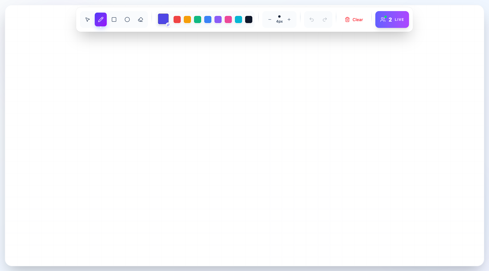
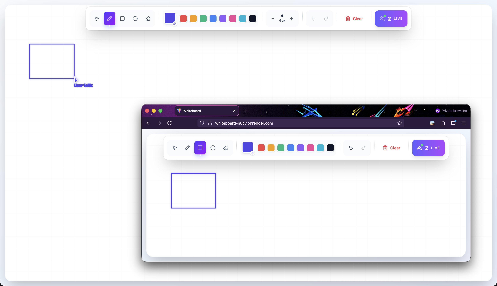

# 🎨 Real-Time Collaborative Whiteboard

A modern, feature-rich collaborative whiteboard application that enables multiple users to draw, sketch, and create together in real-time. Built with the MERN stack and Socket.io for seamless real-time synchronization.


## 📺 Demo

<div align="center">
  <video src="https://github.com/user-attachments/assets/907d0fae-099e-4c5a-a813-25960de4fc8f" width="800" controls>
    Your browser does not support the video tag.
  </video>
</div>


**Live Demo:** [View live url](https://whiteboard-n8c7.onrender.com)

## ✨ Key Features

- 🖌️ **Multiple Drawing Tools**
  - Freehand pencil with adjustable stroke width (1-50px)
  - Geometric shapes (rectangles, circles)
  - Smart eraser with customizable size (10-100px)
  - Selection tool for moving and managing objects

- 🎨 **Advanced Color System**
  - Custom color picker
  - Quick-access color palette with 8 preset colors
  - Real-time color synchronization across users

- 👥 **Real-Time Collaboration**
  - Live cursor tracking with user labels
  - Multi-user drawing synchronization
  - Real-time user count indicator
  - Smooth 30fps cursor updates

- 🔄 **Robust State Management**
  - Full undo/redo history system
  - Drag-and-drop object repositioning
  - Keyboard shortcuts (Delete/Backspace)
  - Persistent drawing state across sessions

- 💎 **Premium UI/UX**
  - Glassmorphism design with backdrop blur
  - Smooth animations and transitions
  - Responsive toolbar with contextual controls
  - Gradient backgrounds and subtle grid patterns

## 🛠️ Tech Stack

### Frontend
- **React 18** with Vite for blazing-fast development
- **React Konva** for high-performance canvas rendering
- **Tailwind CSS** for modern, utility-first styling
- **Lucide React** for beautiful, consistent icons
- **Socket.io Client** for real-time communication

### Backend
- **Node.js** with Express.js
- **Socket.io** for WebSocket management
- **CORS** configuration for secure cross-origin requests
- **Monorepo structure** serving static build in production

## 🏗️ Architecture

```
whiteboard-app/
├── client/                 # React frontend
│   ├── src/
│   │   ├── components/
│   │   │   └── Whiteboard.jsx
│   │   ├── socket/
│   │   │   └── socket.js
│   │   └── App.jsx
│   └── dist/              # Production build
│
├── server/                # Express backend
│   └── index.js          # Socket.io server
│
└── README.md
```

### How It Works

1. **WebSocket Connection**: Client connects to Socket.io server on mount
2. **Event Broadcasting**: Drawing actions are emitted and broadcast to all connected clients
3. **State Synchronization**: Shapes array is synchronized across all users in real-time
4. **Cursor Tracking**: Mouse positions are throttled (30fps) and broadcast with user metadata
5. **History Management**: Local undo/redo stack with socket synchronization

## 🚀 Getting Started

### Prerequisites

- Node.js (v16 or higher)
- npm or yarn

### Installation

1. **Clone the repository**
```bash
git clone https://github.com/yourusername/real-time-whiteboard.git
cd real-time-whiteboard
```

2. **Install server dependencies**
```bash
cd server
npm install
```

3. **Install client dependencies**
```bash
cd ../client
npm install
```

### Environment Variables

Create a `.env` file in the `server` directory:

```env
PORT=5000
CLIENT_URL=http://localhost:5173
NODE_ENV=development
```

### Running Locally

1. **Start the backend server**
```bash
cd server
npm run dev
```

2. **Start the frontend development server** (in a new terminal)
```bash
cd client
npm run dev
```

3. **Open your browser**
```
http://localhost:5173
```

### Production Build

1. **Build the client**
```bash
cd client
npm run build
```

2. **Start the production server**
```bash
cd ../server
NODE_ENV=production npm start
```

The Express server will automatically serve the React build from `client/dist`.

## 🎯 Technical Challenges & Solutions

### Challenge 1: Real-Time Synchronization
**Problem**: Maintaining consistent drawing state across multiple users without lag or conflicts.

**Solution**: 
- Implemented event-driven architecture using Socket.io
- Used broadcast patterns to distribute updates efficiently
- Throttled cursor updates to 30fps to reduce network overhead
- Applied optimistic UI updates for local user actions

### Challenge 2: Canvas Performance
**Problem**: Rendering hundreds of shapes with real-time updates caused performance degradation.

**Solution**:
- Leveraged React Konva for efficient canvas rendering
- Implemented shape batching and lazy rendering
- Used React's memoization to prevent unnecessary re-renders
- Optimized Line components with tension smoothing

### Challenge 3: Undo/Redo with Multi-User
**Problem**: Managing history stack while synchronizing with remote changes.

**Solution**:
- Maintained separate history array with step pointer
- Synchronized history updates through socket events
- Cleared future history on new actions (standard undo/redo pattern)
- Preserved history integrity across network operations

### Challenge 4: Drag-and-Drop Position Synchronization
**Problem**: Pencil strokes rendered incorrectly when dragged due to coordinate system mismatch.

**Solution**:
- Differentiated between absolute positioning (shapes) and relative points (lines)
- Updated line point arrays directly rather than using x/y transforms
- Tracked cumulative drag offsets for accurate repositioning
- Reset x/y to 0 for line-based shapes to prevent double offsetting

## 📚 Lessons Learned

### WebSocket Optimization
- **Throttling is Essential**: Limiting cursor updates to 30fps reduced bandwidth by 66% without affecting UX
- **Event Namespacing**: Separating concerns (shapes, cursors, users) improved code maintainability
- **Broadcast vs Emit**: Understanding when to use `socket.broadcast.emit()` vs `io.emit()` prevented echo effects

### Canvas Performance
- **React Konva Advantages**: Virtual canvas layer management significantly outperformed raw Canvas API
- **Shape Deduplication**: Storing shapes in a flat array with unique IDs enabled efficient updates
- **Shadow Optimization**: Conditional shadow rendering based on selection state improved frame rates

### State Management
- **Immutable Updates**: Using spread operators and slice() prevented reference bugs in history
- **Socket State Sync**: Emitting on every state change ensured consistency but required careful event design
- **Local-First Updates**: Applying changes locally before socket confirmation improved perceived performance

## 🎨 Screenshots

### Main Interface


### Multi-User Collaboration


## 🔧 Available Scripts

### Client
```bash
npm run dev          # Start development server
npm run build        # Create production build
npm run preview      # Preview production build
```

### Server
```bash
npm run dev          # Start development server with nodemon
npm start            # Start production server
```

## 👨‍💻 Author

- GitHub: [@Rajiv-0920](https://github.com/Rajiv-0920)
- LinkedIn: [Your Name](https://www.linkedin.com/in/rajiv0920)
- Portfolio: [https://my-portfolio-nine-green-69.vercel.app/](https://my-portfolio-nine-green-69.vercel.app/)

## 🙏 Acknowledgments

- [React Konva](https://konvajs.org/docs/react/) for the excellent canvas library
- [Socket.io](https://socket.io/) for real-time communication
- [Lucide Icons](https://lucide.dev/) for beautiful iconography
- [Tailwind CSS](https://tailwindcss.com/) for the styling framework

## 🔮 Future Enhancements

- [ ] Save and load whiteboard sessions
- [ ] Export canvas as PNG/PDF
- [ ] Text tool with custom fonts
- [ ] Image upload and manipulation
- [ ] User authentication and private rooms
- [ ] Mobile touch support
- [ ] Collaborative chat feature
- [ ] Infinite canvas with pan and zoom

---

⭐ If you found this project helpful, please give it a star!
